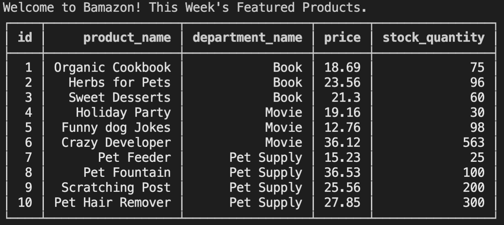
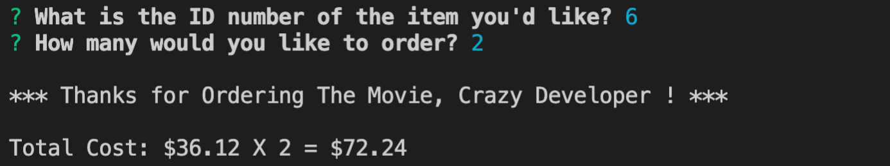
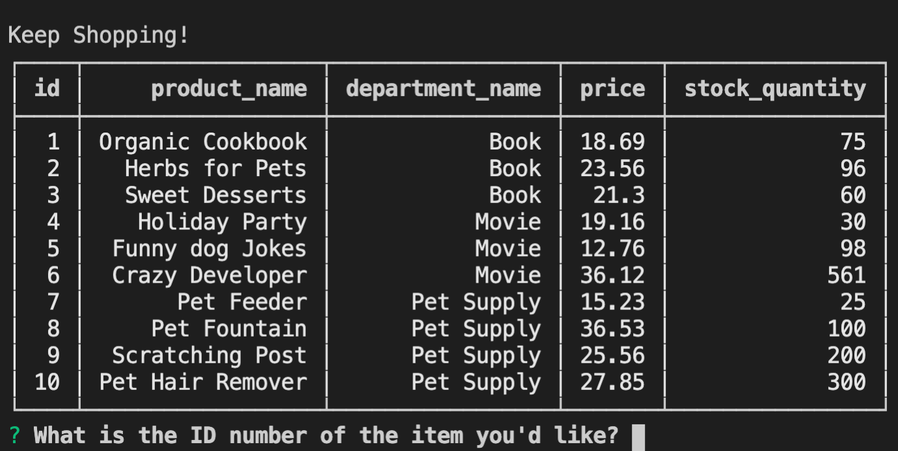

# bamazon

Intro

This Bamazon app is a CLI app. It will display all the available products for sale, take in orders from customers at command line console. Once the customers have placed the orders, the app should show them what they have purchased and the total cost, and reflect the remaining stock quantity. To complete the tasks, need to use MySQL database to create the data table, and several helpful packages, mysql, inquire and console-table-printer.

This is how the app works

1 Ask the customers the ID of the product they would like to purchase.

2 Ask the customers how many units of the products they would like.

3 Update the SQL database to reflect the remaining quantiy .

